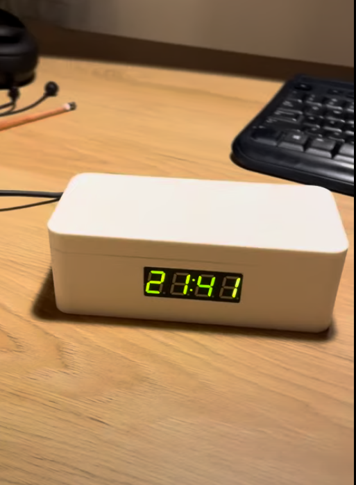
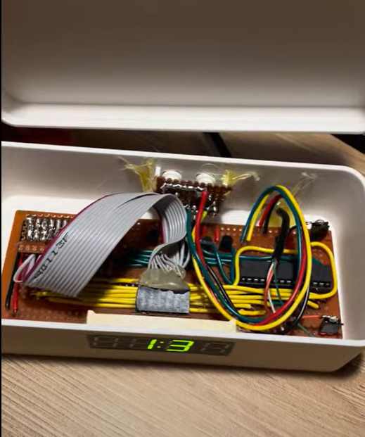
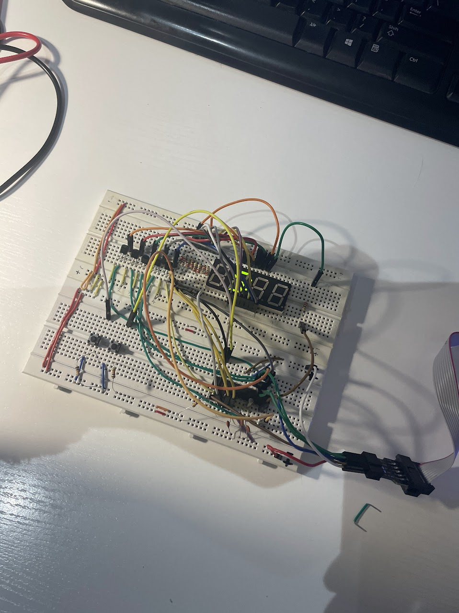
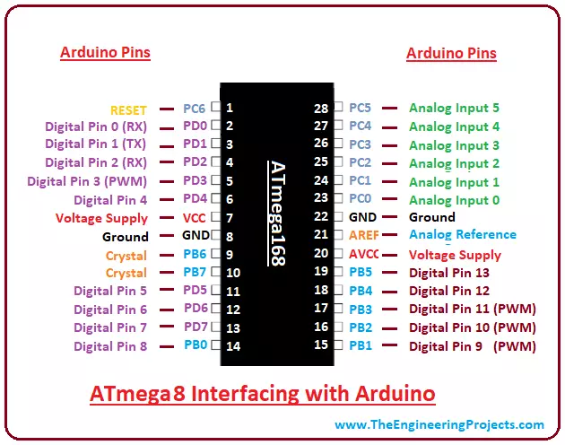
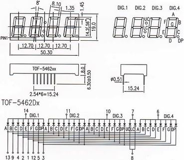
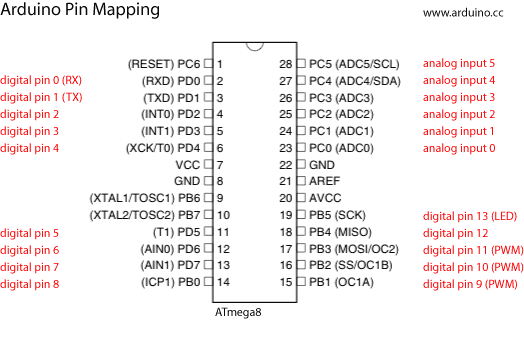
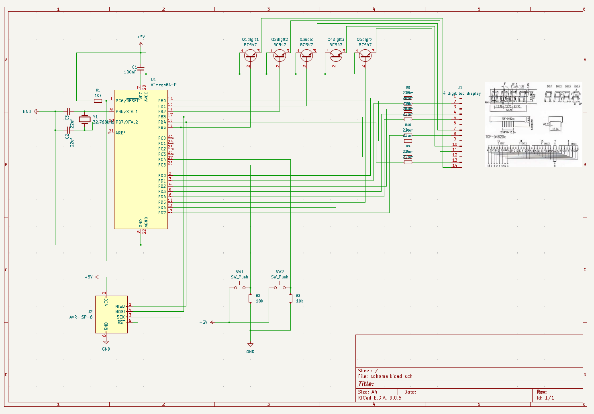
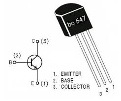

* USBAsp drivers: https://zadig.akeo.ie/
* https://majsterkowo.pl/programowanie-mikrokontrolerow-za-pomoca-programatora-usbasp/
* https://www.youtube.com/watch?v=X01Nhq8TeY0&t=58s
* https://veecad.com/downloads.html

	
LED4-AF-05643FG-B PBF

Wyświetlacz LED 14,20mm 0,56" cztery cyfry

zielony (570nm) , 4000 ucd (10mA) , wspólna anoda

aktywne wszystkie kropki (przy cyfrach i zegarkowe)

typ NPN zacznie przewodzić, gdy do bazy przyłożymy napięcie dodatnie względem emitera, czyli przy standardowym podłączeniu na bazę podamy wysoki potencjał (plus z baterii),
typ PNP zacznie przewodzić, gdy do bazy przyłożymy napięcie ujemne względem emitera, czyli przy standardowym podłączeniu na bazę podamy niski potencjał (masę, minus z baterii).

bc547 b (NPN)
 

 połączenie do atmega8:
 nr pinu wyświetlacza odpowiada pinowi cyfrowemu arduino

Podłączenie anod (+) przez bc547
 displey - atmega
14 - digital pin 13 (DIGIT 1)
11 - digital pin 10 (DIGIT 2)
10 - digital pin 9 (DIGIT 3)
7 - digital pin 6 (UC, LC)
6 - digital pin 5 (DIGIT 4)

podłączenie katod (-) bezpośrednio do atmegi
13 - digital pin 12 (segment A)
9 - digital pin 8 (segment B)
4 - digital pin 3 (segment C)
2 - digital pin 1 (segment D)
1 - digital pin 0 (segment E)
12 - digital pin 11 (segment F)
5 - digital pin 4 (segment G)
3 - digital pin 2 (segment OP)
8 - digital pin 7 (segment UC, LC)

## chatgpt prompt:

napisz mi kod do arduino studio. Posiadam atmega 8 i wyświetlacz 4 segmentowy z kropkami przy cyfrach i dwukropkiem między drugą i trzecią cyfrą. 

Chce zrobić zegarek z wyświetlaczem 7 segmentowym. Oto podłączenie pinów:

 połączenie do atmega8:
 nr pinu wyświetlacza odpowiada pinowi cyfrowemu arduino

Podłączenie anod (-) przez bc547
 displey - atmega
14 - digital pin 13 (DIGIT 1)
11 - digital pin 10 (DIGIT 2)
10 - digital pin 9 (DIGIT 3)
7 - digital pin 6 (UC, LC)
6 - digital pin 5 (DIGIT 4)

podłączenie katod (-) bezpośrednio do atmegi
13 - digital pin 12 (segment A)
9 - digital pin 8 (segment B)
4 - digital pin 3 (segment C)
2 - digital pin 1 (segment D)
1 - digital pin 0 (segment E)
12 - digital pin 11 (segment F)
5 - digital pin 4 (segment G)
3 - digital pin 2 (segment OP)
8 - digital pin 7 (segment UC, LC)

każda cyfra ma wspólną anode, i różne katody.

Stan niski na katodzie włącza wyświetlanie

Chce aby co sekunde migał dwukropem między cyfrą 3 a 2. Są to piny nazwane UC i LC. (anoda ditial pin 6 na atmega, katoda digital pin 7 na atmega)
Komentarze mają być po angielsku